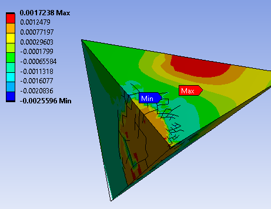
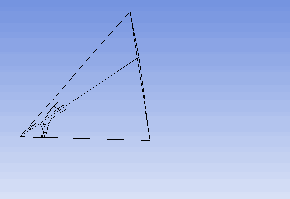

# FEA and AI project

## Introduction

This project has as objectives to 

1.  Implement a model of a tetrahedral element with many more degrees of freedom than a usual one, and create a dataset of load cases and solutions

2. With this model, train a neural network that emulates the model

3. Use the trained neural network to create a new element

### How?

* Feed inputs and geometry, target is displacement field > learns mapping to displacement field 
  * This step is only done so that it can learn how to map inputs to displacement and not be reliant on a third party model to generate a displacement field. The end goal is to have the displacement field be directly fed into the network experimentally.
* Feed displacement field into another neural network, which learns a mapping from that into a simplified stress and strain output at selected nodes, in essence creating a super-element if the displacement field step, which is intermediary, is not considered. This can in theory be obtained by [digital image correlation](https://en.wikipedia.org/wiki/Digital_image_correlation_and_tracking) however deciding about this is something for the future still
  * Alternatively, with a network that is able to predict a displacement field directly from inputs, we can go back to engineering principles and calculates stresses and strains from that. This would reintroduce a lot of assumptions, however it might be worth it in terms of computation

### Bonus Objectives

1. Have the network itself impose new conditions on the model in an adversarial  way to ensure robustness

## Past Progress
#### _Implementing a 2d model for proof of concept_
  * Created script for generating correct geometry inside of SpaceClaim

  * Created script for calling geometry script from Workbench

  * Create script for generating mesh in Mechanical

  * Create script for generating model inside of Workbench

  * Created script for applying forces to element

  * Automated Geometry and Mesh Generation Step

  * Created Folder to save Boundary Conditions and Results files

  * Created script for saving the geometry and mesh

    * The geometry/mesh comes from any results file, as it has nodal number and coordinate location

* Created script for saving the results and boundary conditions

  * The results, boundary conditions and named selections are all exported to .txt files:

    * Results - single file
    * Boundary Conditions - one file for nodal forces and one for displacements
    * Named Selections - One file for each named selection

    

    * 
## Current Work
#### _Implementing a 2d model for proof of concept_

##### Tasks

* Scale it all to generate data continuously
* Pre-process files to be only 2 files, one with inputs and one with outputs

  * Write file with nodal displacements and nodal forces for each named selection
  * Use these files to create a final file with nodes and nodal coordinates, and corresponding nodal displacements and forces

## Element Shape, Force & Nodal Displacement Generation Justification

#### *Element Shape*

Triangular shapes  have an advantage in relation to quadrilaterals in that it is easier to adapt them to any boundary shape. On the other hand, quadrilaterals  tend to exhibit better approximation characteristics than triangles. **By creating triangular elements with the deep learning model comprised of mostly quadrilateral internal elements**, the objective is that the model is able to acquire the better approximation characteristics of quadrilaterals while using triangular elements.

#### *Nodal Selection*

Since the model has many nodes instead of just a handful, applying forces and displacements to edges and vertices is not equivalent to applying them to an usual FEA model as the simplified behaviour of that model is not applicable anymore, and now stress concentrations and the like arise. To overcome this, a random set of nodes has to be selected to emulate forces and displacements in the super element. The nodal selection is performed with a brownian motion of a coordinate system inside of the element, and all nodes within a certain radius are selected, and to ensure that the selections actually select nodes, the coordinate systems are biased to go toward the centroid of the element, and the direction vector that introduces the bias also has a random distribution attached to it. This creates "blobs" of selections which are contiguous most of the time, however sometimes the offset is enough to overcome the radius of selection and the next selectio is not contiguous with the previous. This entire process is controlled by several hyperparameters, and they have been adjusted until they seemed to generate good quality selections most of the time, while at the same time limiting how complex the behaviour could be since the process of creating selections is relatively time-consuming. If a selection selects no node (usually because it is outside of the super element), then the radius is inflated until the selection is able to reach at least one unselected node. 

This selection process is exemplified in the gif below, where two "curves" of blobs are formed.

#### *Forces*

**Forces and moments can be applied to any node of a finite element model**. The model is going to be trained with between 0 and 2 "force curves". These "curves" follow a -somewhat- contiguous nodal selection, and each "blob" of force has random forces assigned to it according to a gaussian distribution. 

#### *Nodal Displacement*

In an usual FEA method the nodal displacements and the interpolation within the element is given by :

Where  u, N and Delta are displacement within the element, shape function and displacement at the nodes, respectively, and N is of a definite shape defined by the type of element and number of nodes.  

On the other hand, Delta is given by the boundary conditions and the equilibrium equation of the element using the stiffness matrix K, with the equation:

Where F is the reactions (actions to be more precise, as it is the negative of the actual reactions) at the nodes. 

The goal is thus that, given a set of boundary conditions and forces along the entire element, the model directly learns a certain equivalent mapping M that that maps into the displacement field within the entire element. 

Therefore the element has to be generated with **arbitrary nodal displacements to train the model.** However during the training process it became obvious that nodal displacements only on the vertices don't work well for the simulation since the "nodes" on the vertices in this case are much more malleable and are stress concentrators than the rest of the element, thus, the simulation doesn't show any interesting behaviour no matter the forces except  for a very large distortion at the vertices if the model is only held by them. A similar approach of using random displacements via a gaussian distribution on somewhat contiguous blobs of selection is used for the displacements.

Using this approach, the following type of element is generated. The image shows the directional displacement field of the solution during one of the testing iterations:

And after adding forces to another test element, this is a sample result:

The mapping function will, in essence, encapsulate both the stiffness matrix and the shape function if the model is trained in a simulation set, or, in theory, the real world behaviour of the material if trained on actual experiments.

## Relevant Links

[How to execute APDL commands from python session](https://www.youtube.com/watch?v=bSP9pi-4QW0)

[Use a Named Selection as Scoping of a Load or Support](https://ansyshelp.ansys.com/account/secured?returnurl=/Views/Secured/corp/v201/en/act_script/act_script_examples_NamedSelection_as_Scoping.html)

[Export Result Object to STL](https://ansyshelp.ansys.com/account/secured?returnurl=/Views/Secured/corp/v201/en/act_script/act_script_examples_export_result_object.html) *CAN ONLY ACCES ANSYS SCRIPTING GUIDE THROUGH INSIDE OF MECHANICAL > USE SEARCH FUNCTIONS "SCRIPTING"*

[Using IronPython/ACT console](https://www.youtube.com/watch?v=txPimWRh8nM) 

[Creating XML and Python in Ansys](https://www.youtube.com/watch?v=fURQ-22YKmc)

[ANSYS scripting examples](https://ansyshelp.ansys.com/account/secured?returnurl=/Views/Secured/corp/v201/en/act_script/pt03.html) *CAN ONLY ACCES ANSYS SCRIPTING GUIDE THROUGH INSIDE OF MECHANICAL > USE SEARCH FUNCTIONS "SCRIPTING"*